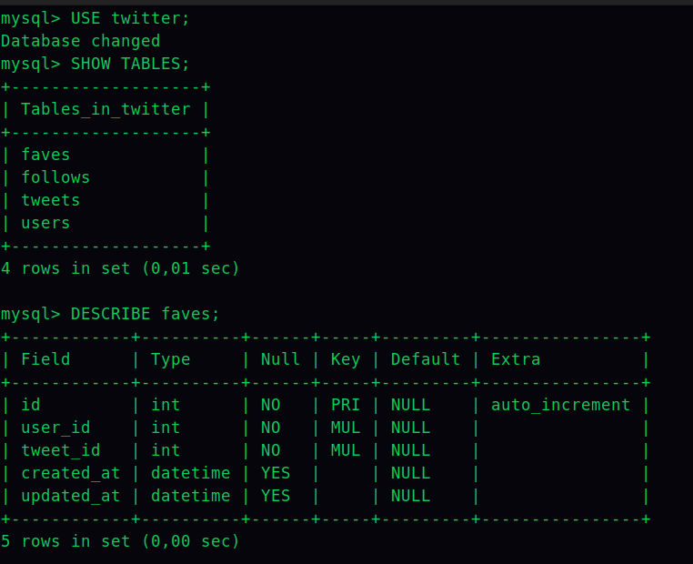
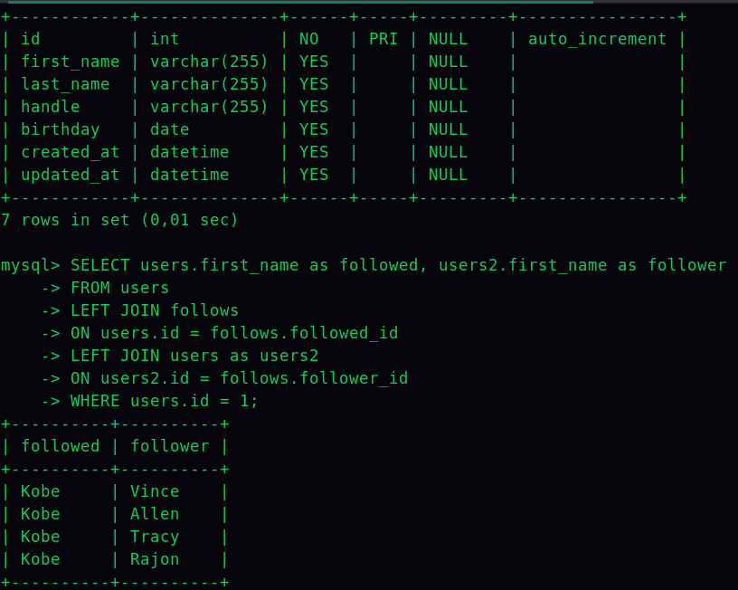

# Databases
A database is a collection of information that is organized so that it can be easily accessed, managed, and updated. Something that is important while designing a database is to make sure that the data is stored in a way that makes it easy to find and use, avoiding repetition, increasing efficiency and reducing querying. This is called data normalization.

## Tables
- Rows (records)
- Columns (fields)
- Primary Key (unique identifier)
- Foreign Key (reference to another table)

## Views
- Virtual tables
- Filtered, sorted, and grouped data
- Can be used to hide complexity

## Procedures
- Structure logic with native SQL (if, while, for, etc.)

## Triggers
Automatic notifications/actions when data is changed. They are used to maintain data integrity.

### Querying
To use mysql from the command line (linux):
```bash
mysql -u root -p
```
The command above will ask for the password. To see the databases:
```sql
SHOW DATABASES;
```
To use a database:
```sql
USE database_name;
```
To see the tables:
```sql
SHOW TABLES;
```
To see the columns of a table:
```sql
DESCRIBE table_name;
```
To see the data of a table:
```sql
SELECT * FROM table_name;
```
To create a database:
```sql
CREATE SCHEMA `data_base_name` DEFAULT CHARACTER SET utf8 COLLATE utf8_general_ci ;
USE `data_base_name` ;

CREATE TABLE `data_base_name`.`users` (
  `id` INT NOT NULL AUTO_INCREMENT,
  `name` VARCHAR(45) NULL,
  `email` VARCHAR(45) NULL,
  PRIMARY KEY (`id`));
```

## ERD (Entity Relationship Diagram)
A diagram that shows the relationships of entity sets stored in a database. It is a graphical representation of entities and their relationships to each other.

## Relationships
### One-to-One
One record in a table is related to one and only one record in another table.
```sql
CREATE TABLE `mydb`.`users` (
  `id` INT NOT NULL AUTO_INCREMENT,
  `name` VARCHAR(45) NULL,
  `email` VARCHAR(45) NULL,
  PRIMARY KEY (`id`));

CREATE TABLE `mydb`.`user_details` (
    `id` INT NOT NULL AUTO_INCREMENT,
    `user_id` INT NOT NULL,
    `address` VARCHAR(45) NULL,
    `phone` VARCHAR(45) NULL,
    PRIMARY KEY (`id`),
    INDEX `user_id_idx` (`user_id` ASC),
    CONSTRAINT `user_id`
        FOREIGN KEY (`user_id`)
        REFERENCES `mydb`.`users` (`id`)
        ON DELETE NO ACTION
        ON UPDATE NO ACTION);
```
The reference to the users table is called a foreign key. The foreign key is a field (or collection of fields) in one table that uniquely identifies a row of another table or the same table. In simple words, the foreign key is defined in a second table, but it refers to the primary key in the first table.

### One-to-Many
One record in a table is related to zero, one, or many records in another table.
```sql
CREATE TABLE `mydb`.`users` (
  `id` INT NOT NULL AUTO_INCREMENT,
  `name` VARCHAR(45) NULL,
  `email` VARCHAR(45) NULL,
  PRIMARY KEY (`id`));

CREATE TABLE `mydb`.`posts` (
    `id` INT NOT NULL AUTO_INCREMENT,
    `user_id` INT NOT NULL,
    `title` VARCHAR(45) NULL,
    `body` VARCHAR(45) NULL,
    PRIMARY KEY (`id`),
    INDEX `user_id_idx` (`user_id` ASC),
    CONSTRAINT `user_id`
        FOREIGN KEY (`user_id`)
        REFERENCES `mydb`.`users` (`id`)
        ON DELETE NO ACTION
        ON UPDATE NO ACTION);
```
The foreign key is store in the many table.

### Many-to-Many
Many records in a table are related to many records in another table.

```sql
CREATE TABLE `mydb`.`users` (
  `id` INT NOT NULL AUTO_INCREMENT,
  `name` VARCHAR(45) NULL,
  `email` VARCHAR(45) NULL,
  PRIMARY KEY (`id`));

CREATE TABLE `mydb`.`roles` (
    `id` INT NOT NULL AUTO_INCREMENT,
    `name` VARCHAR(45) NULL,
    PRIMARY KEY (`id`));

CREATE TABLE `mydb`.`user_roles` (
    `id` INT NOT NULL AUTO_INCREMENT,
    `user_id` INT NOT NULL,
    `role_id` INT NOT NULL,
    PRIMARY KEY (`id`),
    INDEX `user_id_idx` (`user_id` ASC),
    INDEX `role_id_idx` (`role_id` ASC),
    CONSTRAINT `user_id`
        FOREIGN KEY (`user_id`)
        REFERENCES `mydb`.`users` (`id`)
        ON DELETE NO ACTION
        ON UPDATE NO ACTION,
    CONSTRAINT `role_id`
        FOREIGN KEY (`role_id`)
        REFERENCES `mydb`.`roles` (`id`)
        ON DELETE NO ACTION
        ON UPDATE NO ACTION);
```
In this case a third table is created to store the relationship between the two tables.
## Normalization
The process of organizing data in a database to minimize redundancy and dependency of data. Normalization is a process used to organize a database into tables and columns. The idea is that a table should be about a specific topic and that only those columns which support that topic are included. For example, a spreadsheet containing information on salespeople, sales offices, customers, and orders might require multiple tables to be normalized into two tables: salespeople and customers.

### Normal Forms
- First Normal Form – The information is stored in a relational table with each column containing atomic values. There should be no repeating groups of columns.
- Second Normal Form – The table is in first normal form and all the columns depend on the table’s primary key.
- Third Normal Form – the table is in second normal form and all of its columns are not transitively dependent on the primary key.

## Conventions
The following are some conventions I use when creating a database, they are not mandatory but they are a good practice and even some frameworks use them:
- Name of the table in plural and everything in lowercase.
- Use id as primary key and auto increment.
- name of the foreign keys with singular_table_name_id
- use created_at and updated_at
- use timestamps
- use snake_case for columns

## Data Types
list of data types: https://dev.mysql.com/doc/refman/5.7/en/data-types.html

## SQL (Structured Query Language)

### SELECT
The following query selects all columns from the table named. The asterisk (*) is a wildcard character that matches any column name
```sql
SELECT * FROM table_name;
```
The following query selects only the name and email columns from the table named users, assigning the email column an alias of email_address. The alias is used to rename a column or table using an alternative name. It will also sort the results by the name column in ascending/descending order and limit the number of results to 3.
Note: We should use the ORDER BY clause after the WHERE clause.

```sql
SELECT email as email_address, column2, column3
FROM table_name
WHERE condition
ORDER BY column1 ASC|DESC
LIMIT 3;
```
The following query selects all users with name ending in "e".
```sql
SELECT * 
FROM users
WHERE first_name LIKE "%e";
```
The following query selects all users with name starting in "e".
```sql
SELECT *
FROM users
WHERE first_name LIKE "e%";
```
The following query selects all users with name not starting in "K".
```sql
SELECT * 
FROM users
WHERE first_name NOT LIKE "K%";
```
```sql
SELECT *
FROM users
WHERE first_name LIKE "%e"
ORDER BY birthday DESC;
```
The following query selects the user in the third position (offset 2) and returns the next 3 users.
```sql
SELECT *
FROM users
LIMIT 3
OFFSET 2;
```
The following query selects all users with id between 2 and 5. Same as the previous query.
```sql
SELECT *
FROM users
LIMIT 2,3;
```
Alternatively, you can use the BETWEEN operator to select a range of values.
```sql
SELECT *
FROM users
WHERE id BETWEEN 2 AND 5;
```
## Inserting
```sql
INSERT INTO `data_base_name`.`table_name` (column1, column2, column3, ...)
VALUES (value1, value2, value3, ...), (value1, value2, value3, ...), ...;
```

## Updating
```sql 
UPDATE `data_base_name`.`table_name`
SET column1 = value1, column2 = value2, ...
WHERE condition;
```

## Deleting
```sql
DELETE FROM `data_base_name`.`table_name`
WHERE condition;
```

## Functions
```sql
SELECT FUNCTION(column_name)
FROM table_name;
```
- COUNT
- AVG
- SUM
- MAX
- MIN
To find more functions: https://dev.mysql.com/doc/refman/8.0/en/string-functions.html

## Joins
- INNER JOIN: Returns records that have matching values in both tables
- LEFT JOIN: Returns all records from the left table, and the matched records from the right table
- RIGHT JOIN: Returns all records from the right table, and the matched records from the left table

### INNER JOIN
```sql
SELECT column_name(s)
FROM table1
INNER JOIN table2
ON table1.column_name = table2.column_name;
```
### LEFT JOIN
```sql
SELECT column_name(s)
FROM table1
LEFT JOIN table2
ON table1.column_name = table2.column_name;
```
### RIGHT JOIN
```sql
SELECT column_name(s)
FROM table1
RIGHT JOIN table2
ON table1.column_name = table2.column_name;
```

### UNION
The UNION operator is used to combine the result-set of two or more SELECT statements.
```sql
SELECT column_name(s) FROM table1
UNION
SELECT column_name(s) FROM table2;
```
### GROUP BY
The GROUP BY statement is often used with aggregate functions (COUNT, MAX, MIN, SUM, AVG) to group the result-set by one or more columns.
```sql
SELECT column_name, aggregate_function(column_name)
FROM table_name
WHERE column_name operator value
GROUP BY column_name;
```
#### Aggregate Functions
- COUNT
- AVG
- SUM
- MAX
- MIN
- GROUP_CONCAT

```sql
SELECT SUM(column_name), YEAR(created_at), COUNT(*), table1_name.column_name, table2_name.column_name GROUP BY table1_name.column_name, table2_name.column_name, YEAR(created_at);
```

There are some especial cases when a table is referenced more than once in a query. In this case, we need to use aliases to differentiate between the different tables. This is commonly used when we need to join a table to itself.  
Note the following example is from coding dojo - MySQL course.  
We have the following case:

in the image you can see that we have a table called users and a table called follows. The follows table has two columns: followed_id and follower_id. The followed_id column references the id column in the users table and the follower_id column also references the id column in the users table. So, we have a many-to-many relationship between the users and the follows table. If we want to get all the users that are following a specific user (user with id=1 in this case), we can use the following query:

```sql
SELECT users.first_name as followed, users2.first_name as follower
FROM users
LEFT JOIN follows
ON users.id = follows.followed_id
LEFT JOIN users as users2
ON users2.id = follows.follower_id
WHERE users.id = 1;
```
The result of this query will be:


### Useful Queries

<!-- ```sql
mysql> CREATE DATABASE stock_control
    -> ;
Query OK, 1 row affected (0,01 sec)

mysql> use stock_control;
Database changed
mysql> CREATE TABLE product (
    -> id INT AUTO_INCREMENT,
    -> name VARCHAR(50) NOT NULL,
    -> description VARCHAR(255),
    -> quantity INT NOT NULL DEFAULT 0,
    -> PRIMARY KEY(id)
    -> )Engine=InnoDB;
``` -->
<!-- Engine=InnoDB is the default engine for MySQL 5.5.3 and later. It specifies the storage engine for the table. InnoDB is a transaction-safe engine with row-level locking. It also supports foreign keys and transactions. -->

Change the name of a table
```sql
ALTER TABLE product RENAME TO products;
```
rename a column
```sql
ALTER TABLE products CHANGE name product_name VARCHAR(50);
```
add a column
```sql
ALTER TABLE products ADD COLUMN price DECIMAL(10,2);
```
drop a column
```sql
ALTER TABLE products DROP COLUMN price;
```
add a foreign key
```sql
ALTER TABLE products ADD CONSTRAINT category_id FOREIGN KEY (category_id) REFERENCES categories(id);
```
drop a foreign key
```sql
ALTER TABLE products DROP FOREIGN KEY category_id;
```
add a primary key
```sql
ALTER TABLE products ADD PRIMARY KEY (id);
```
drop a primary key
```sql
ALTER TABLE products DROP PRIMARY KEY;
```
add a unique key
```sql
ALTER TABLE products ADD UNIQUE KEY (product_name);
```

## Useful links
- https://dev.mysql.com/doc/refman/8.0/en/sql-data-manipulation-statements.html
- https://www.w3schools.com/sql/
- https://www.mysqltutorial.org/mysql-foreign-key/